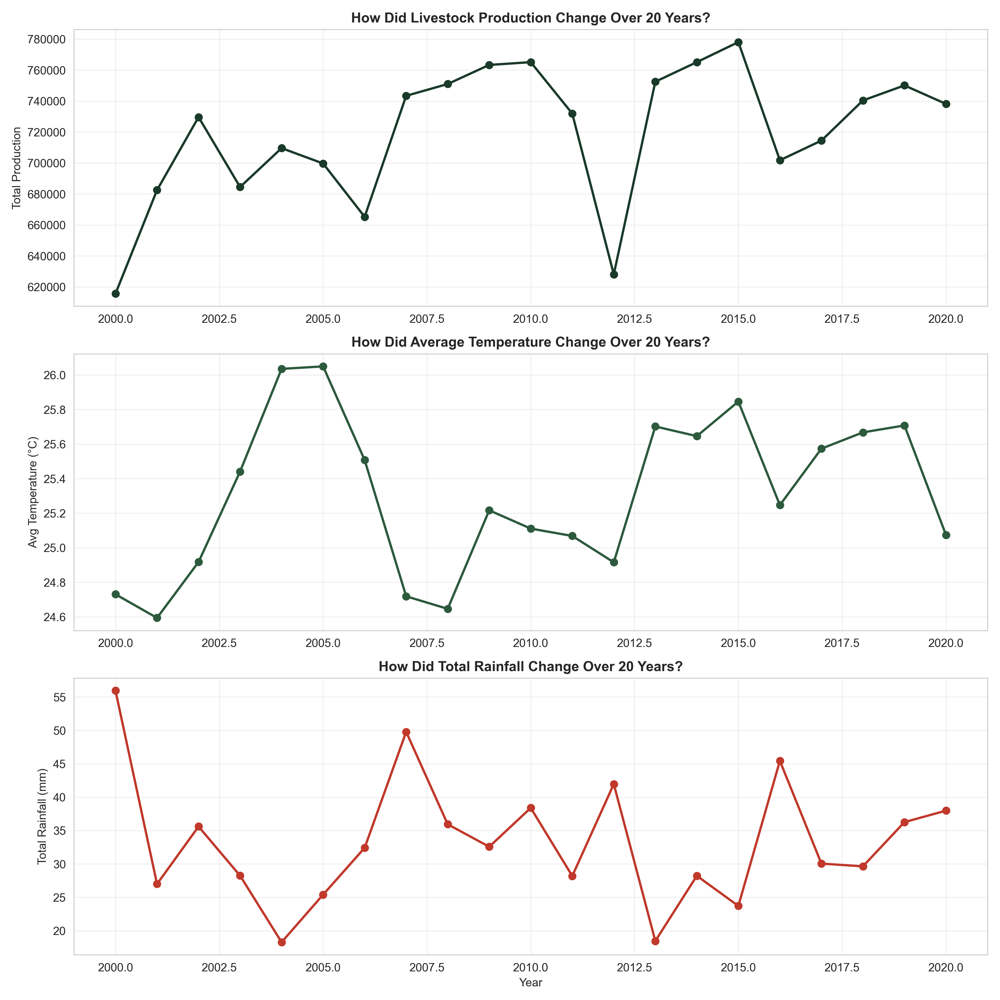
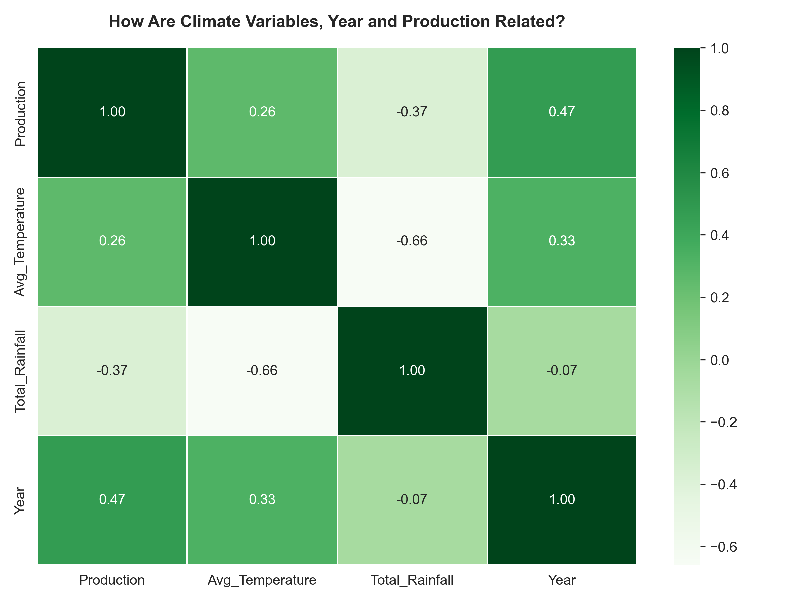
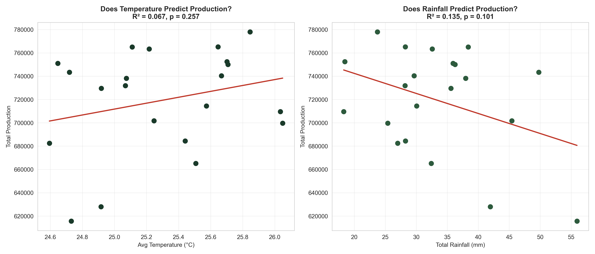
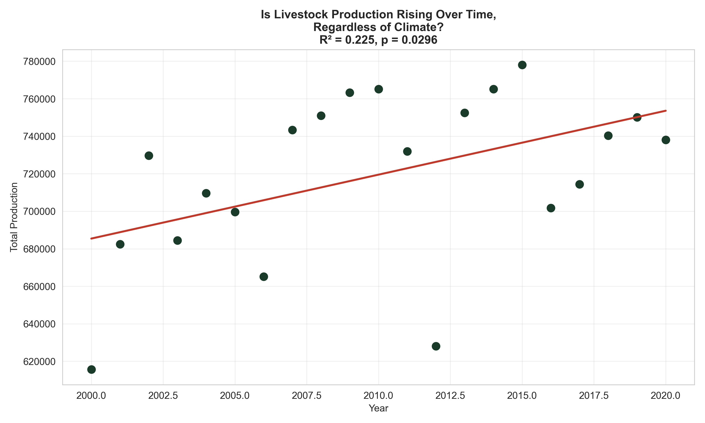

# Modeling the Relationship Between Climate Variables and Livestock Production in Nigeria (2000-2020)

## Project Overview
This project statistically tests whether temperature and rainfall
predict total livestock production in Nigeria over a 21-year period
(2000-2020). Using Python, I merged monthly NASA POWER climate data
with FAO livestock production data (Cattle, Goat, Sheep), then ran
correlation and regression analysis to formally test a relationship
that is often assumed but rarely statistically verified in
agricultural discussions.

## Objectives
- Merge and clean monthly climate data with yearly livestock
  production data
- Test whether temperature significantly predicts total livestock
  production
- Test whether rainfall significantly predicts total livestock
  production
- Test whether production shows a significant trend over time,
  independent of climate
- Quantify how much of the variation in production climate
  variables actually explain

## Data Sources
| Dataset | Source | Period |
|---------|--------|--------|
| Climate Data (Temperature, Rainfall) | NASA POWER Dataset | 2000-2020 (monthly) |
| Livestock Production (Cattle, Goat, Sheep) | FAO Global Livestock Database | 2000-2020 (yearly) |

## Methodology
- Monthly climate data aggregated to yearly averages (temperature)
  and yearly totals (rainfall) using Pandas
- Livestock production data reshaped from wide format (one column
  per year, 1961-2020) to long format, then filtered to 2000-2020
  and summed across all three livestock types per year
- Both datasets merged on Year into a single analysis-ready table
- Pearson correlation calculated for Temperature vs Production,
  Rainfall vs Production, and Year vs Production
- Simple linear regression run separately for Temperature and
  Rainfall as predictors of Production
- Multiple linear regression run using Temperature and Rainfall
  together as predictors
- Year regressed against Production to test for a time trend
  independent of climate

## Key Findings

**1. Temperature Does Not Significantly Predict Production**
A simple linear regression of Temperature on Production returned
R-squared = 0.067 and p = 0.257. Temperature alone explains less
than 7% of the variation in total livestock production, and this
relationship is not statistically significant.

**2. Rainfall Does Not Significantly Predict Production**
A simple linear regression of Rainfall on Production returned
R-squared = 0.135 and p = 0.101. Rainfall explains about 14% of
the variation in production, but the relationship falls short of
statistical significance at the 0.05 threshold.

**3. Temperature and Rainfall Combined Still Do Not Significantly
   Explain Production**
A multiple regression using both Temperature and Rainfall together
returned R-squared = 0.136, meaning both climate variables combined
explain only about 14% of the variation in production, barely more
than rainfall alone. This confirms that climate variables, whether
tested individually or together, are weak predictors of livestock
production in this dataset.

**4. Production Shows a Statistically Significant Upward Trend
   Over Time**
Unlike temperature and rainfall, Year was found to be a
statistically significant predictor of Production (R-squared =
0.226, p = 0.0296). Production increased by an estimated 3,408
units per year across the 21-year period, a trend independent of
year-to-year climate fluctuations. This is the only statistically
significant relationship found in the entire analysis.

## Conclusions
This project finds that temperature and rainfall are not
statistically significant predictors of livestock production in
Nigeria over the 2000-2020 period, whether tested individually or
together, with both models explaining less than 14% of the
variation in production. What does show a significant relationship
with production is time itself, with production rising steadily
year over year regardless of climate conditions in any given year.
This points toward non-climatic drivers, such as improved farming
practices, policy changes, market demand, or veterinary and health
interventions, as more likely explanations for the observed growth
in production than short-term climate variability.

## Recommendations
1. Future research should investigate non-climatic variables
   directly, such as feed cost, veterinary service access,
   government agricultural policy changes, and market prices, to
   identify what is actually driving the significant year-over-year
   increase in production found in this study.
2. Given the weak explanatory power of temperature and rainfall
   (R-squared under 0.14 in all models tested), climate alone should
   not be treated as a primary driver of livestock production
   planning in Nigeria based on this dataset.
3. A longer time series, or the inclusion of extreme climate years
   (droughts or floods), may be needed to detect a climate effect
   that this relatively stable 21-year window did not capture.
4. This statistical finding strengthens the case for prioritizing
   agricultural policy and farm management research over
   climate-focused interventions when addressing livestock
   production growth in Nigeria.
5. Future modeling could explore non-linear relationships (for
   example, polynomial regression) or livestock-type-specific
   models, since this analysis tested only the aggregate production
   trend across Cattle, Goat, and Sheep combined.

## Statistical Summary

| Predictor | R-squared | P-value | Statistically Significant |
|-----------|-----------|---------|---------------------------|
| Temperature | 0.067 | 0.257 | No |
| Rainfall | 0.135 | 0.101 | No |
| Temperature + Rainfall (Multiple Regression) | 0.136 | - | No |
| Year (Time Trend) | 0.226 | 0.0296 | Yes |

## Visualizations
### Production, Temperature, and Rainfall Trends Over Time

### Correlation Heatmap

### Regression Plots (Temperature and Rainfall)

### Production Trend Over Time

## Tools Used
- Python
- Pandas
- NumPy
- Matplotlib
- Seaborn
- SciPy
- Jupyter Notebook

## Skills Demonstrated
- Merging and reshaping multi-source datasets (wide to long format)
- Correlation and regression analysis
- Statistical hypothesis testing and p-value interpretation
- Data visualization and scientific plotting
- Applying statistical methods to test assumed relationships in
  agricultural data, an approach directly relevant to evidence-based
  decision making in animal agriculture research

## Author
**Olafimihan Bamidele John**
Animal Scientist | Data Analyst
Based in Nigeria
